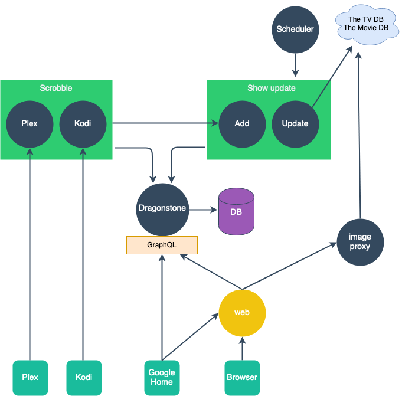

# Episodehunter 📺

> mono repo for episodehunter

<p align="center">
  <a href="https://episodehunter.tv/">
    
  </a>
</p>

[](https://codecov.io/gh/episodehunter/episodehunter)

## Into

Episodehunter is a open source project to track what tv shows you are watching. Works with Plex, Kodi and Google Home.

## Services

<p align="center">
  
</p>

### Dragonstone 🏯

The heart of all data. This service expose an api to access and manipulate the stored data.

### Hugin 🦉

Track internal events

### Image proxy 🖼

Fetching images and manipulate them on the fly

### Scheduler ⏰

Like cron job for episodehunter

### Scrobble 📺

Expose a api for plex and kodi to register what the user is watching

### Show update 🔄

A service that adds and update tv shows

## Libraries

### Kingsguard ⚔️

A library for better error handling

### Logger 📗

A simple log library

### TheTvDB 👽

Helper library for the tv db api

### TMDB 🛸

Helper library for the movie db api

### Types 🌀

Shared typescript types

### Utils 🛠

Util functions for episodehunter

## Developing

Bootstrap

```
npx lerna bootstrap
```

Test:

```
npx lerna run test
```
